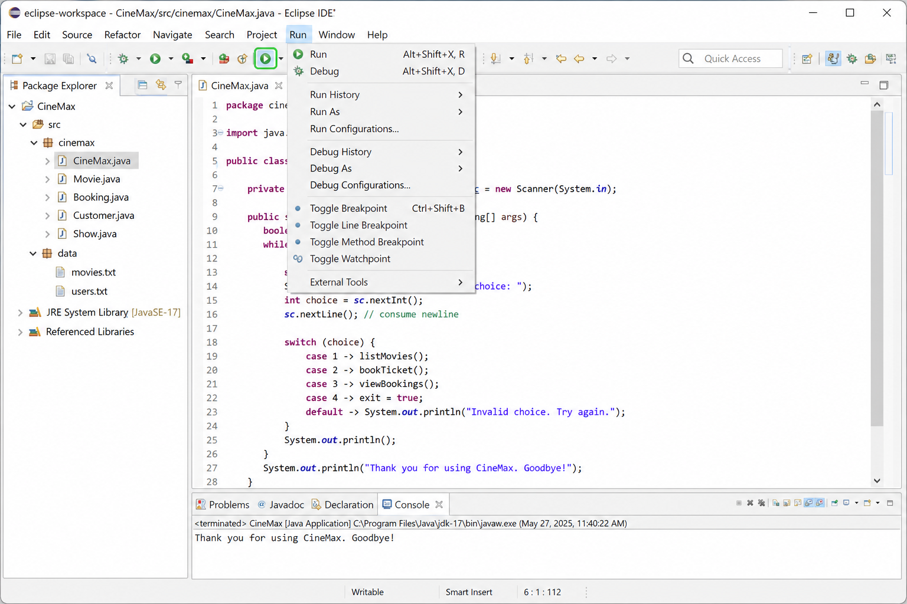
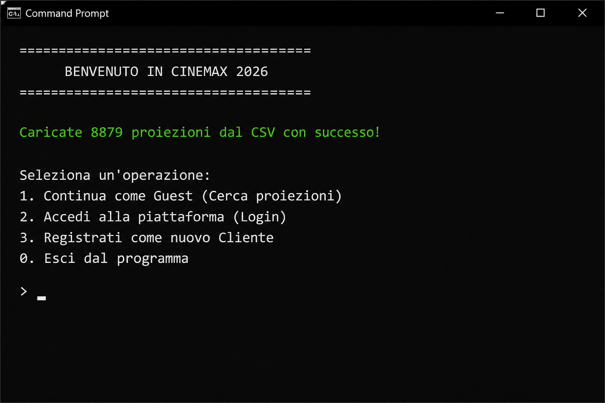
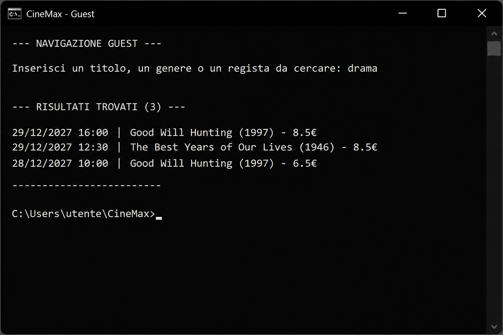
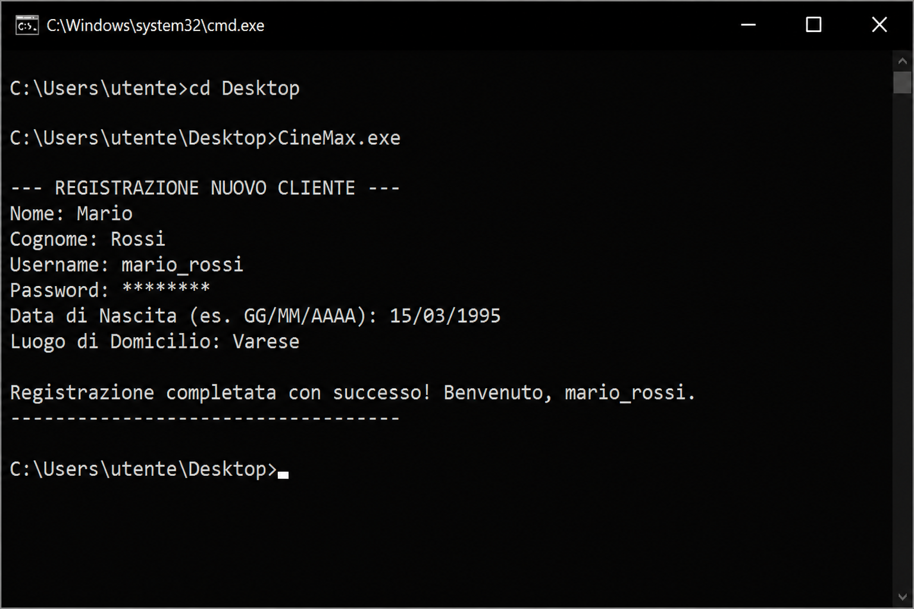
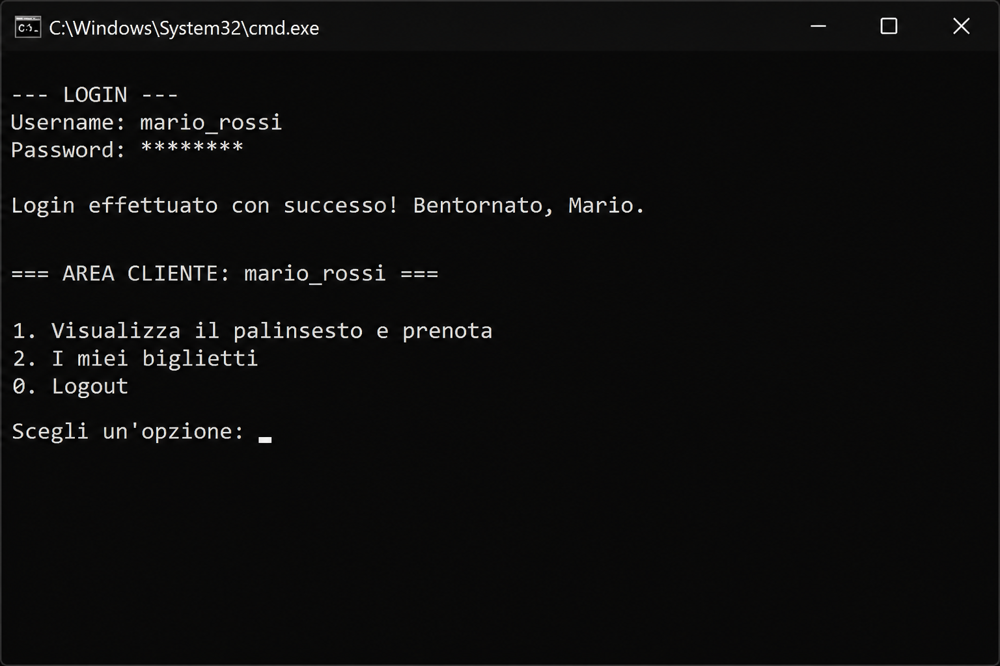
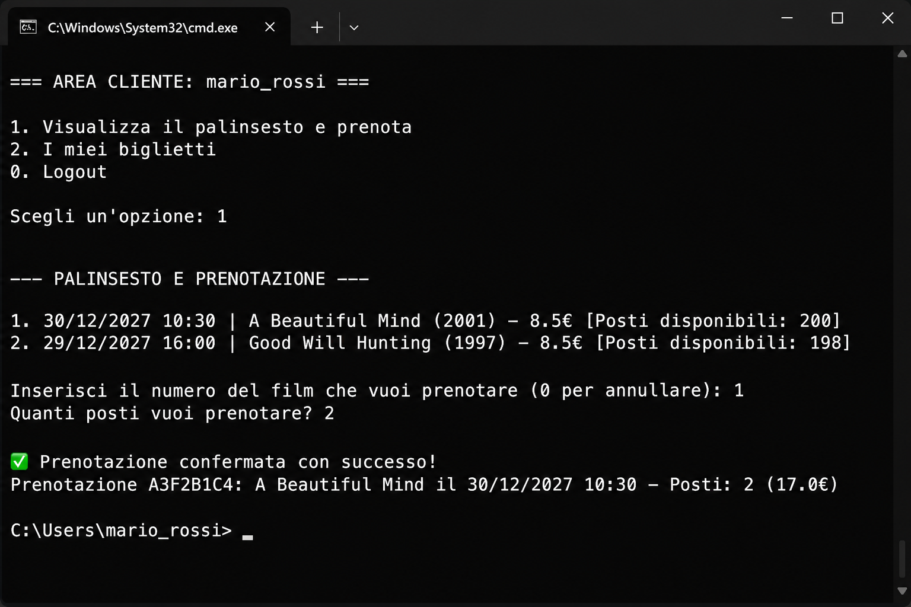
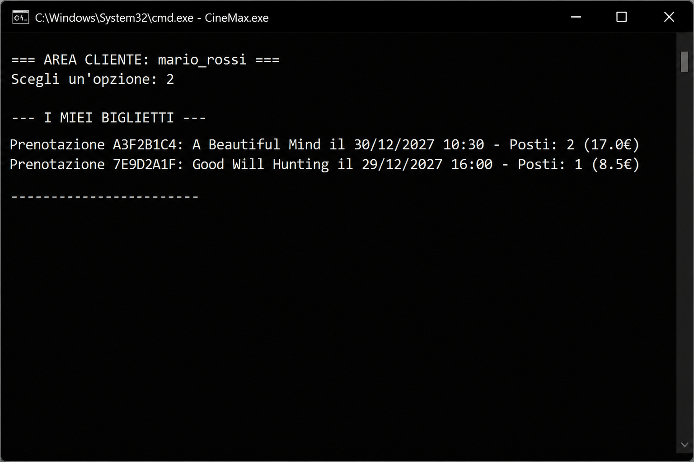

# CineMax — Manuale Utente

---

## Frontespizio

| | |
|---|---|
| **Titolo** | CineMax — Sistema di prenotazione biglietti cinematografici |
| **Autori** | Daniele Paoli, Edoardo Pigni, Anes Khaia|
| **Data** | 23 agosto 2026 |
| **Versione documento** | 1.0 |

---

## Indice

1. [Cos'è CineMax](#1-cosè-cinemax)
2. [Installazione](#2-installazione)
   - 2.1 [Requisiti di sistema](#21-requisiti-di-sistema)
   - 2.2 [Setup dell'ambiente di sviluppo](#22-setup-dellambiente-di-sviluppo)
   - 2.3 [Installazione del programma](#23-installazione-del-programma)
3. [Esecuzione e uso](#3-esecuzione-e-uso)
   - 3.1 [Setup e lancio del programma](#31-setup-e-lancio-del-programma)
   - 3.2 [Uso delle funzionalità](#32-uso-delle-funzionalità)
     - [Menu principale](#321-menu-principale)
     - [Modalità Guest — Cerca proiezioni](#322-modalità-guest--cerca-proiezioni)
     - [Registrazione di un nuovo cliente](#323-registrazione-di-un-nuovo-cliente)
     - [Accesso alla piattaforma (Login)](#324-accesso-alla-piattaforma-login)
     - [Area Cliente — Prenotazione biglietti](#325-area-cliente--prenotazione-biglietti)
     - [Area Cliente — I miei biglietti](#326-area-cliente--i-miei-biglietti)
     - [Area Proiezionista e Bigliettaio](#327-area-proiezionista-e-bigliettaio)
     - [Uscita dal programma](#328-uscita-dal-programma)
4. [Data set di test](#4-data-set-di-test)
5. [Limiti della soluzione sviluppata](#5-limiti-della-soluzione-sviluppata)
6. [Sitografia / Bibliografia](#6-sitografia--bibliografia)

---

## 1. Cos'è CineMax

**CineMax** è un programma pensato per gestire le prenotazioni dei biglietti di un cinema. Permette di consultare la lista delle proiezioni, cercare i film per titolo, genere o regista, registrarsi come cliente e prenotare i posti in sala.

Il programma funziona attraverso una **finestra testuale** (detta anche *riga di comando* o *terminale*): non presenta pulsanti o icone grafiche, ma un menu numerato a cui si risponde digitando un numero e premendo **Invio**.

CineMax distingue tre tipologie di utenti:

| Ruolo | Descrizione |
|---|---|
| **Guest (ospite)** | Può solo consultare e cercare le proiezioni, senza registrarsi |
| **Cliente** | Può prenotare biglietti e consultare le proprie prenotazioni |
| **Proiezionista / Bigliettaio** | Personale del cinema (funzionalità ancora in fase di sviluppo) |

All'avvio il programma carica automaticamente l'elenco delle proiezioni da un file di dati e, se necessario, crea gli account del personale predefinito.

---

## 2. Installazione

### 2.1 Requisiti di sistema

Per utilizzare CineMax è necessario disporre di un computer con le seguenti caratteristiche:

| Requisito | Dettaglio |
|---|---|
| **Sistema operativo** | Windows 10 o superiore, macOS o Linux |
| **Java** | Java Runtime Environment (JRE) versione **8 o superiore**, oppure Java Development Kit (JDK) per la compilazione |
| **Spazio su disco** | Circa 50 MB (inclusi i file di dati del palinsesto) |
| **Memoria RAM** | Almeno 512 MB liberi |
| **Connessione Internet** | Necessaria solo per scaricare Java e l'ambiente di sviluppo; **non** richiesta per l'uso quotidiano del programma |

> **Nota:** CineMax non richiede un database esterno né un server web: tutti i dati vengono salvati in file presenti nella cartella `data` del progetto.

### 2.2 Setup dell'ambiente di sviluppo

Per installare ed eseguire CineMax si consiglia l'utilizzo dell'ambiente **Eclipse IDE for Java Developers**, un programma gratuito che permette di aprire, compilare ed eseguire progetti Java in modo semplice.

#### Passo 1 — Installare Java

1. Aprire il browser e visitare il sito [Adoptium (Eclipse Temurin)](https://adoptium.net/).
2. Scaricare la versione **JDK 17 LTS** (o superiore) compatibile con il proprio sistema operativo.
3. Avviare il programma di installazione scaricato e seguire le istruzioni a schermo, accettando le impostazioni predefinite.
4. Al termine, verificare l'installazione aprendo il **Prompt dei comandi** (Windows) o il **Terminale** (macOS/Linux) e digitando:

   ```
   java -version
   ```

   Se l'installazione è andata a buon fine, verrà visualizzata la versione di Java installata.

#### Passo 2 — Installare Eclipse

1. Visitare il sito [Eclipse Downloads](https://www.eclipse.org/downloads/).
2. Scaricare **Eclipse IDE for Java Developers**.
3. Estrarre l'archivio scaricato in una cartella a scelta (ad esempio `C:\Eclipse` su Windows).
4. Avviare Eclipse facendo doppio clic sull'eseguibile `eclipse.exe` (Windows) o `eclipse` (macOS/Linux).
5. Al primo avvio, selezionare una cartella di *workspace* (l'area di lavoro dove verranno salvati i progetti) e confermare.

### 2.3 Installazione del programma

Una volta preparato l'ambiente, procedere come segue per installare CineMax:

#### Opzione A — Da repository Git (consigliata)

1. Aprire Eclipse.
2. Andare su **File → Import → Git → Projects from Git**.
3. Inserire l'indirizzo del repository del progetto e clonarlo nella propria cartella di lavoro.
4. Al termine dell'importazione, il progetto **CineMax** apparirà nel pannello *Package Explorer* a sinistra.

#### Opzione B — Da archivio ZIP

1. Scaricare o copiare la cartella del progetto CineMax sul proprio computer.
2. Aprire Eclipse.
3. Andare su **File → Open Projects from File System**.
4. Selezionare la cartella `CineMax` e premere **Finish**.

#### Struttura del progetto

Dopo l'installazione, la cartella del progetto avrà questa organizzazione:

```
CineMax/
├── src/cinemax/          ← Codice sorgente del programma
│   ├── CineMax.java      ← Programma principale (punto di avvio)
│   ├── GestoreDati.java  ← Gestione file e dati
│   ├── Utente.java       ← Modello utente
│   ├── Proiezione.java   ← Modello proiezione cinematografica
│   ├── Prenotazione.java ← Modello prenotazione biglietti
│   └── OrarioDoc.java    ← Classe di supporto per la gestione degli orari
├── data/                 ← File di dati del cinema
│   ├── proiezioni.csv    ← Palinsesto completo delle proiezioni
│   ├── utenti.dat        ← Utenti registrati (creato al primo avvio)
│   └── prenotazioni.dat  ← Prenotazioni effettuate (creato alla prima prenotazione)
└── doc/                  ← Documentazione del progetto
```

> **Importante:** non spostare o rinominare la cartella `data`, perché il programma legge e scrive i file al suo interno.

---

## 3. Esecuzione e uso

### 3.1 Setup e lancio del programma

#### Avvio da Eclipse (metodo consigliato)

1. Aprire Eclipse e caricare il progetto CineMax.
2. Nel pannello *Package Explorer*, espandere `src → cinemax`.
3. Fare clic destro sul file **`CineMax.java`**.
4. Selezionare **Run As → Java Application**.



*Figura 1 — Avvio di CineMax dall'ambiente Eclipse*

5. Nella parte inferiore di Eclipse comparirà la **Console**: è la finestra testuale in cui interagire con il programma.

#### Avvio da riga di comando (metodo alternativo)

1. Aprire il **Prompt dei comandi** o il **Terminale**.
2. Spostarsi nella cartella principale del progetto CineMax:

   ```
   cd percorso\verso\CineMax
   ```

3. Compilare il programma:

   ```
   javac -d bin -sourcepath src src/cinemax/*.java
   ```

4. Avviare il programma:

   ```
   java -cp bin cinemax.CineMax
   ```

> **Attenzione:** il programma deve essere avviato dalla cartella principale del progetto (quella che contiene la sottocartella `data`), altrimenti non riuscirà a trovare i file di dati.

#### Schermata di benvenuto

All'avvio, CineMax mostra un messaggio di benvenuto e carica automaticamente le proiezioni dal file di dati:



*Figura 2 — Schermata iniziale con il menu principale*

---

### 3.2 Uso delle funzionalità

#### 3.2.1 Menu principale

Dopo l'avvio, il programma presenta quattro opzioni:

| Opzione | Descrizione |
|---|---|
| **1** | Continua come Guest — cerca proiezioni senza registrarsi |
| **2** | Accedi alla piattaforma — effettua il login con username e password |
| **3** | Registrati come nuovo Cliente — crea un account personale |
| **0** | Esci dal programma |

Per scegliere un'opzione, digitare il numero corrispondente e premere **Invio**.

---

#### 3.2.2 Modalità Guest — Cerca proiezioni

La modalità Guest permette a chiunque di consultare il palinsesto **senza creare un account**.

**Procedura:**

1. Dal menu principale, digitare **1** e premere Invio.
2. Quando richiesto, digitare una parola chiave da cercare: può essere il **titolo** di un film, un **genere** (es. *Drama*, *Action*) o il nome di un **regista**.
3. Il programma mostrerà l'elenco delle proiezioni che corrispondono alla ricerca, con data, ora, titolo, anno e prezzo del biglietto.



*Figura 3 — Esempio di ricerca per genere "Drama"*

**Esempio pratico:**

```
Inserisci un titolo, un genere o un regista da cercare: Lynch

--- RISULTATI TROVATI (3) ---
28/12/2027 15:30 | Blue Velvet (1986) - 7.5€
26/12/2027 10:00 | Blue Velvet (1986) - 7.5€
21/12/2027 10:00 | Blue Velvet (1986) - 7.5€
```

Se nessun film corrisponde alla ricerca, verrà mostrato il messaggio *"Nessun film trovato"*.

> **Suggerimento:** la ricerca non distingue tra maiuscole e minuscole. È sufficiente digitare una parte del titolo o del nome del regista.

---

#### 3.2.3 Registrazione di un nuovo cliente

Per prenotare biglietti è necessario creare un account personale.

**Procedura:**

1. Dal menu principale, digitare **3** e premere Invio.
2. Compilare i campi richiesti uno alla volta:

   | Campo | Descrizione | Esempio |
   |---|---|---|
   | Nome | Il proprio nome | Mario |
   | Cognome | Il proprio cognome | Rossi |
   | Username | Nome utente univoco per l'accesso | mario_rossi |
   | Password | Password personale (non può essere vuota) | miaPassword123 |
   | Data di Nascita | Nel formato GG/MM/AAAA | 15/03/1995 |
   | Luogo di Domicilio | Città di residenza | Varese |

3. Se l'username scelto è già in uso, il programma chiederà di selezionarne un altro.
4. Al termine, verrà mostrato un messaggio di conferma.



*Figura 4 — Schermata di registrazione completata*

> **Nota:** i dati inseriti vengono salvati automaticamente nel file `data/utenti.dat` e saranno disponibili ai successivi avvii del programma.

---

#### 3.2.4 Accesso alla piattaforma (Login)

Dopo la registrazione (o in qualsiasi momento successivo), è possibile accedere al proprio account.

**Procedura:**

1. Dal menu principale, digitare **2** e premere Invio.
2. Inserire il proprio **Username**.
3. Inserire la propria **Password**.
4. Se le credenziali sono corrette, il programma mostra un messaggio di benvenuto e apre l'area riservata in base al ruolo dell'utente.



*Figura 5 — Login effettuato con successo e accesso all'area Cliente*

Se username o password non sono corretti, viene mostrato un messaggio di errore e si torna al menu principale per riprovare.

---

#### 3.2.5 Area Cliente — Prenotazione biglietti

Una volta effettuato il login come Cliente, si accede a un menu dedicato con tre opzioni:

| Opzione | Descrizione |
|---|---|
| **1** | Visualizza il palinsesto e prenota |
| **2** | I miei biglietti |
| **0** | Logout (torna al menu principale) |

**Procedura per prenotare un biglietto:**

1. Scegliere l'opzione **1**.
2. Viene mostrato l'elenco completo delle proiezioni disponibili, ciascuna con:
   - Data e ora della proiezione
   - Titolo e anno del film
   - Prezzo del biglietto
   - Numero di **posti ancora disponibili** in sala (massimo 200 per proiezione)
3. Digitare il **numero** corrispondente al film desiderato (oppure **0** per annullare).
4. Indicare **quanti posti** si desidera prenotare.
5. Se i posti richiesti sono disponibili, la prenotazione viene confermata con un riepilogo che include:
   - Codice univoco della prenotazione (8 caratteri)
   - Titolo del film e data/ora
   - Numero di posti prenotati
   - Costo totale in euro



*Figura 6 — Esempio di prenotazione completata con successo*

**Messaggi di errore possibili durante la prenotazione:**

| Messaggio | Causa | Cosa fare |
|---|---|---|
| *"Devi prenotare almeno un posto"* | Inserito 0 o un numero negativo | Inserire un numero di posti ≥ 1 |
| *"ci sono solo X posti disponibili"* | Posti insufficienti in sala | Ridurre il numero di posti richiesti |
| *"Scelta non valida"* | Numero film fuori dall'elenco | Scegliere un numero presente nell'elenco |
| *"devi inserire un numero intero"* | Inserito testo al posto di un numero | Digitare solo cifre |

---

#### 3.2.6 Area Cliente — I miei biglietti

Per consultare tutte le prenotazioni effettuate in precedenza:

1. Dall'area Cliente, scegliere l'opzione **2**.
2. Il programma elenca tutte le prenotazioni associate al proprio username, mostrando per ciascuna:
   - Codice prenotazione
   - Titolo del film
   - Data e ora della proiezione
   - Numero di posti
   - Costo totale



*Figura 7 — Elenco delle prenotazioni del cliente*

Se non sono state effettuate prenotazioni, compare il messaggio *"Non hai ancora effettuato nessuna prenotazione."*

---

#### 3.2.7 Area Proiezionista e Bigliettaio

Il personale del cinema (Proiezionisti e Bigliettai) dispone di account predefiniti creati automaticamente al primo avvio del programma. Attualmente, l'accesso con questi account mostra un messaggio di benvenuto e informa che le funzionalità dedicate **sono ancora in fase di sviluppo**.

| Ruolo | Username predefinito | Password |
|---|---|---|
| Proiezionista 1 | `proiezionista1` | `pass123` |
| Proiezionista 2 | `proiezionista2` | `pass123` |
| Bigliettaio 1–5 | `bigliettaio1` … `bigliettaio5` | `pass123` |

> **Nota:** questi account sono pensati per il personale e non permettono la prenotazione di biglietti come clienti.

---

#### 3.2.8 Uscita dal programma

Per chiudere CineMax in qualsiasi momento:

1. Tornare al **menu principale** (se si è nell'area Cliente, scegliere **0 — Logout**).
2. Digitare **0** e premere Invio.
3. Il programma mostrerà il messaggio *"Uscita in corso. Grazie per aver usato CineMax!"* e terminerà.

---

## 4. Data set di test

CineMax utilizza file di dati predefiniti per simulare il funzionamento di un cinema reale. Di seguito la descrizione dei file presenti nella cartella `data/`.

### 4.1 File `proiezioni.csv`

Contiene il **palinsesto completo** del cinema con **8.878 proiezioni** programmate. Ogni riga rappresenta una singola proiezione e include:

| Campo | Descrizione | Esempio |
|---|---|---|
| Data e ora | Quando si svolge la proiezione | 2027-12-30 10:30:00 |
| Titolo film | Nome del film | A Beautiful Mind |
| Genere | Categoria cinematografica | Biography |
| Regista | Regista del film | Ron Howard |
| Anno | Anno di uscita | 2001 |
| Durata | Durata in minuti | 135 |
| Età minima | Limite di età consigliato | 12 |
| Prezzo biglietto | Costo in euro | 8.50 |

Il file include film di vario genere (Drama, Action, Comedy, Biography, Crime, Adventure, ecc.) distribuiti nel periodo dicembre 2027.

### 4.2 File `utenti.dat`

Viene creato automaticamente al **primo avvio** del programma se non esiste già. Contiene:

- **2 Proiezionisti** predefiniti (`proiezionista1`, `proiezionista2`)
- **5 Bigliettai** predefiniti (`bigliettaio1` … `bigliettaio5`)
- Tutti i **Clienti** registrati dagli utenti durante l'utilizzo del programma

### 4.3 File `prenotazioni.dat`

Viene creato automaticamente alla **prima prenotazione** effettuata. Contiene lo storico di tutte le prenotazioni, con codice univoco, username del cliente, film scelto, data/ora, numero di posti e costo totale.

### 4.4 Account di test consigliati

Per provare rapidamente tutte le funzionalità del programma:

| Scenario | Procedura |
|---|---|
| **Consultare il palinsesto** | Avviare il programma → opzione **1** (Guest) → cercare "Drama" o "Lynch" |
| **Registrarsi e prenotare** | Opzione **3** → compilare i dati → opzione **2** (Login) → opzione **1** (Prenota) |
| **Verificare le prenotazioni** | Dopo aver prenotato → opzione **2** (I miei biglietti) |
| **Accedere come personale** | Opzione **2** → username `proiezionista1`, password `pass123` |

---

## 5. Limiti della soluzione sviluppata

La versione attuale di CineMax (1.0) presenta alcune limitazioni che è utile conoscere:

### Interfaccia e usabilità

- Il programma utilizza esclusivamente un'**interfaccia a riga di comando** (testuale). Non dispone di un'interfaccia grafica con finestre, pulsanti o immagini.
- L'interazione avviene digitando numeri e testo: non è possibile usare il mouse.

### Funzionalità incomplete

- L'**area Proiezionista** e l'**area Bigliettaio** sono presenti ma **non ancora operative**: al login il personale visualizza solo un messaggio di accesso consentito e un avviso che il backend è in fase di sviluppo.
- Non è possibile **modificare o cancellare** una prenotazione già effettuata.
- Non è prevista la **recupero password** in caso di smarrimento.

### Gestione dati

- I dati vengono salvati in **file locali** sulla macchina in cui gira il programma. Non esiste sincronizzazione tra più computer.
- Le password degli utenti vengono salvate **in chiaro** (senza crittografia): la soluzione non è adatta a un utilizzo in produzione con dati reali.
- Il calcolo dei posti disponibili si basa sul titolo del film e sulla data/ora: proiezioni dello stesso film in orari diversi vengono gestite correttamente, ma la capienza è fissa a **200 posti** per ogni proiezione.
- La classe `OrarioDoc` (utilità per la gestione degli orari) è presente nel codice sorgente ma **non è ancora integrata** nelle funzionalità visibili all'utente.

### Validazione input

- La data di nascita inserita in fase di registrazione **non viene verificata** formalmente: il programma accetta qualsiasi testo nel formato suggerito.
- Non esiste un controllo sull'**età minima** richiesta per la visione di un film al momento della prenotazione.

### Requisiti tecnici

- Il programma deve essere avviato dalla **cartella radice del progetto** per trovare correttamente i file nella cartella `data`.
- È necessario avere Java installato: senza Java il programma non può essere eseguito.

---

## 6. Sitografia / Bibliografia

### Sitografia

- Eclipse Foundation, *Eclipse IDE for Java Developers*, Online: [https://www.eclipse.org/downloads/](https://www.eclipse.org/downloads/)
- Adoptium (Eclipse Temurin), *Download Java JDK*, Online: [https://adoptium.net/](https://adoptium.net/)
- Oracle Corporation, *Java Documentation — Getting Started*, Online: [https://docs.oracle.com/en/java/](https://docs.oracle.com/en/java/)
- Oracle Corporation, *The Java™ Tutorials*, Online: [https://docs.oracle.com/javase/tutorial/](https://docs.oracle.com/javase/tutorial/)
- Git SCM, *Git — Documentazione ufficiale*, Online: [https://git-scm.com/doc](https://git-scm.com/doc)
- W3Schools, *Java Tutorial*, Online: [https://www.w3schools.com/java/](https://www.w3schools.com/java/)

### Bibliografia

- D. Flanagan, *Java in a Nutshell*, O'Reilly Media, 2022
- H. Schildt, *Java: The Complete Reference*, McGraw-Hill Education, 2021
- J. Bloch, *Effective Java*, Addison-Wesley Professional, 2018
- Università dell'Insubria, *Laboratorio A — Specifiche Progetto CineMax*, dispensa didattica, 2025/2026

---

*Fine del Manuale Utente — CineMax v1.0*
